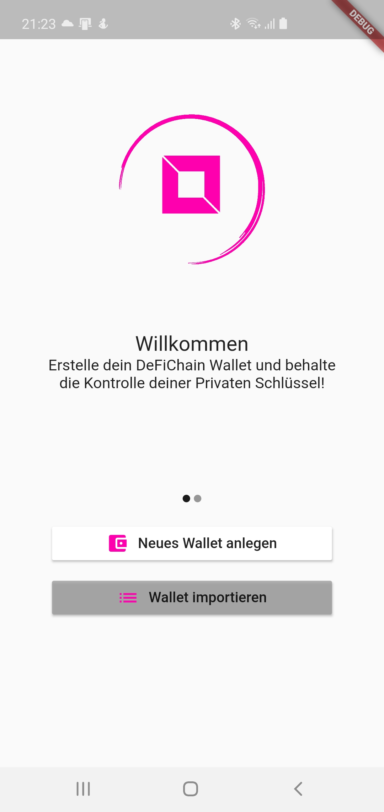
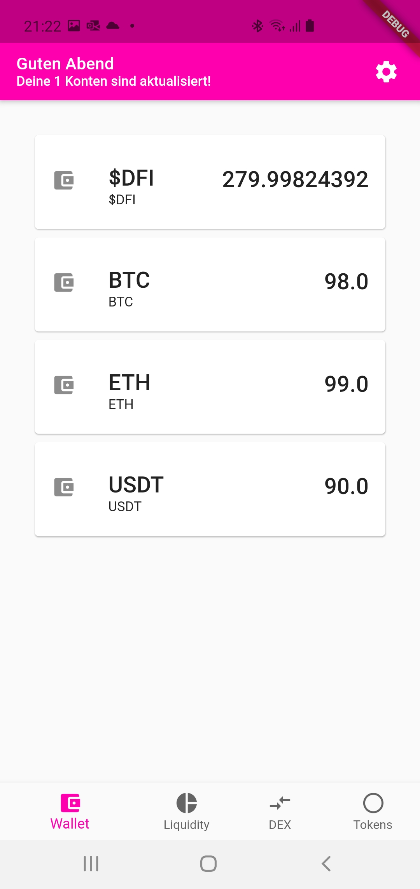
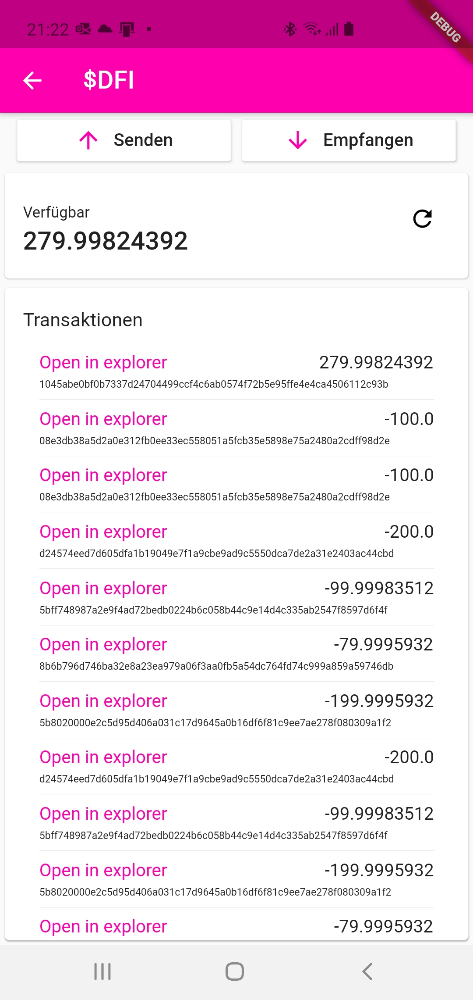
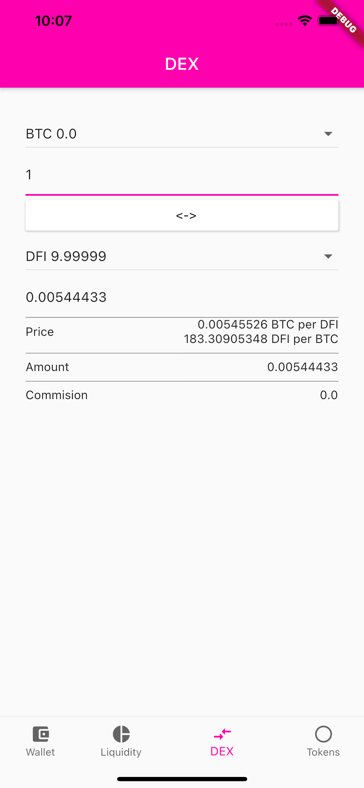

# defichainwallet
Android
[](https://dev.azure.com/defich-wallet/DefiCh-Wallet/_build/latest?definitionId=6&branchName=main)

iOS
[](https://dev.azure.com/defich-wallet/DefiCh-Wallet/_build/latest?definitionId=7&branchName=main)

A mobile application for [DeFiChain](https://defichain.com/).

# Donate
[](https://en.cryptobadges.io/donate/18iSZjac28YeCeis8pzWxSqCTVw6d9UGCf)

 - Donate $DFI to Patrik: dHRaGab9wDEaXeeAVjWK1Pgk1LCsZU2s7t
 - Donate $DFI to Dominik: dJLbxzJLype9h8QnmckK1KSDEiM8kGbHqK

# Documentation
- [Getting started](#getting-started)
- [Status](#status)
- [Development](#development)
- [Contributors](#contributors)
- [Screenshots](#screenshots)
- [Disclaimer](#disclaimer)

# Getting Started
Work in Progress - you can soon download the app in the store.

Remember - use at your own risk. This software is still a WIP!

## Can I trust this code?
> Don't trust. Verify.

We recommend every user of this code to audit and verify any underlying code for its validity and suitability, including reviewing any and all of your project's dependencies.

Mistakes and bugs happen, but with your help in resolving and reporting, together we can produce open source software that is:

- Easy to audit and verify,
- Tested, with test coverage >95%,
- Advanced and feature rich and
- Friendly, with a strong and helpful community, ready to answer questions.

# Status
## Wallet
* View Funds
  * Sync your wallet
  * See all funds ($DFI, DST)
* Send $DFI funds

## DEX
WIP

## Liquidity Pool
WIP

## Tokens
You can already see a list of all tokens. Thats it. And thats all you need in a mobile app.


# Development
Install flutter and vscode or some other IDE.

## Build
We are working in the Flutter beta channel. 

``` 
flutter channel beta
flutter upgrade
flutter config --enable-web

flutter pub get
flutter build apk //for android
flutter build ios //for iOS
flutter build web //for web
```

# Contributors

* [Patrik](https://github.com/p3root)
* [Dominik](https://github.com/dpfaffenbauer)


# Screenshots
Everything is just early preview!







# Disclaimer
No one who is contributing to this project is taking any responsibility of what happens to your funds. 


# Licenses

The DeFi Wallet App is released under the terms of the G GNU GENERAL PUBLIC LICENSE Version 3.
