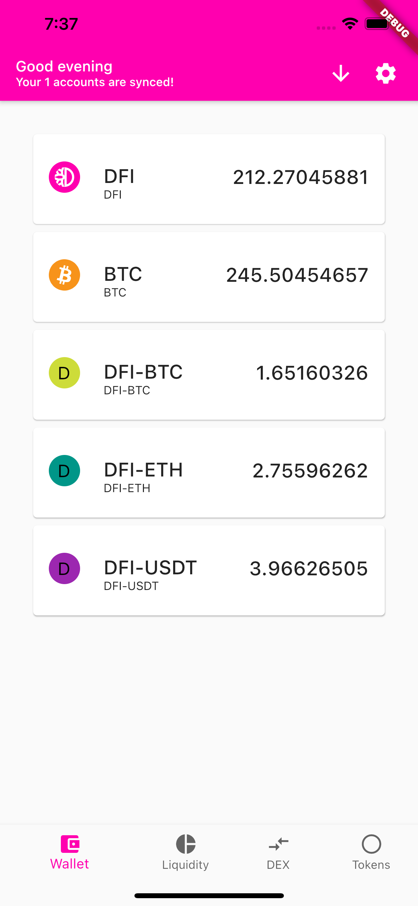
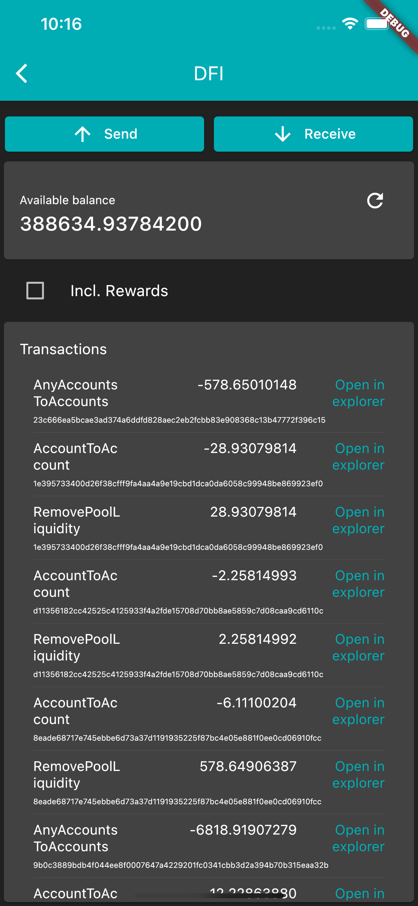
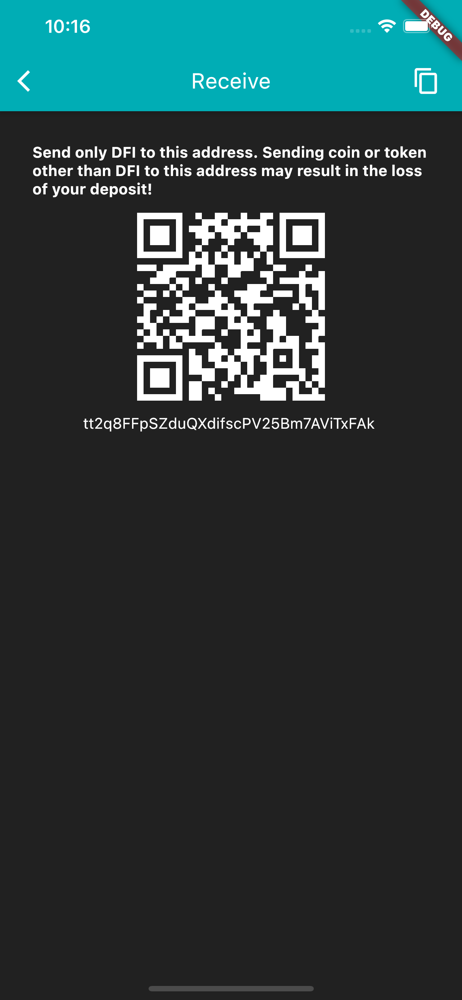
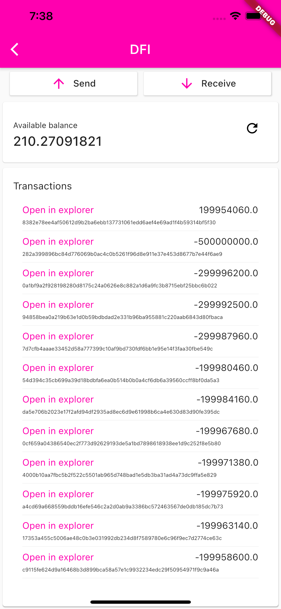
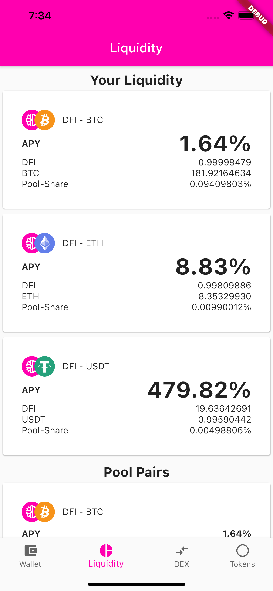
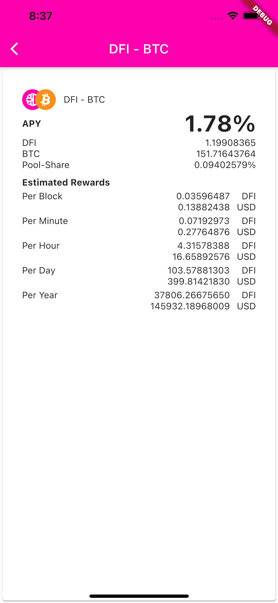

# saiive.live
[](https://dev.azure.com/saiive/saiive/_build/latest?definitionId=23&branchName=main)

A mobile application for [DeFiChain](https://defichain.com/).

# Donate
[](https://en.cryptobadges.io/donate/18iSZjac28YeCeis8pzWxSqCTVw6d9UGCf)

 - Donate $DFI: dResgN7szqZ6rysYbbj2tUmqjcGHD4LmKs

# Documentation
- [Getting started](#getting-started)
- [Status](#status)
- [Development](#development)
- [Contributors](#contributors)
- [Screenshots](#screenshots)
- [Disclaimer](#disclaimer)

# Getting Started
Work in Progress - you can soon download the app in the store.

Remember - use at your own risk. This software is still a WIP!

## Can I trust this code?
> Don't trust. Verify.

We recommend every user of this code to audit and verify any underlying code for its validity and suitability, including reviewing any and all of your project's dependencies.

Mistakes and bugs happen, but with your help in resolving and reporting, together we can produce open source software that is:

- Easy to audit and verify,
- Tested, with test coverage >95%,
- Advanced and feature rich and
- Friendly, with a strong and helpful community, ready to answer questions.

# Status
## Wallet
* View Funds
  * Sync your wallet
  * See all funds ($DFI, DATs and BTC)
* Send funds - $DFI, DATs and BTC
* Receive funds - $DFI, DATs and BTC
* Swap Tokens - $DFI <-> DATs
* Add Liquidity 
* Remove Liquidity
* List Tokens
* List History


# Development
Install flutter and vscode or some other IDE.

## Build
We are working in the Flutter beta channel. 

``` 
flutter channel beta
flutter upgrade

flutter pub get
flutter build apk //for android
flutter build ios //for iOS
flutter build web //for web
flutter build macos //for macos
flutter build windows //for windows
flutter build linux //for linux
```

# Contributors

* [Patrik](https://github.com/p3root)
* [Dominik](https://github.com/dpfaffenbauer)


# Screenshots
Everything is just early preview!











# Disclaimer
No one who is contributing to this project is taking any responsibility of what happens to your funds. 


# Licenses

The DeFi Wallet App is released under the terms of the G GNU GENERAL PUBLIC LICENSE Version 3.
